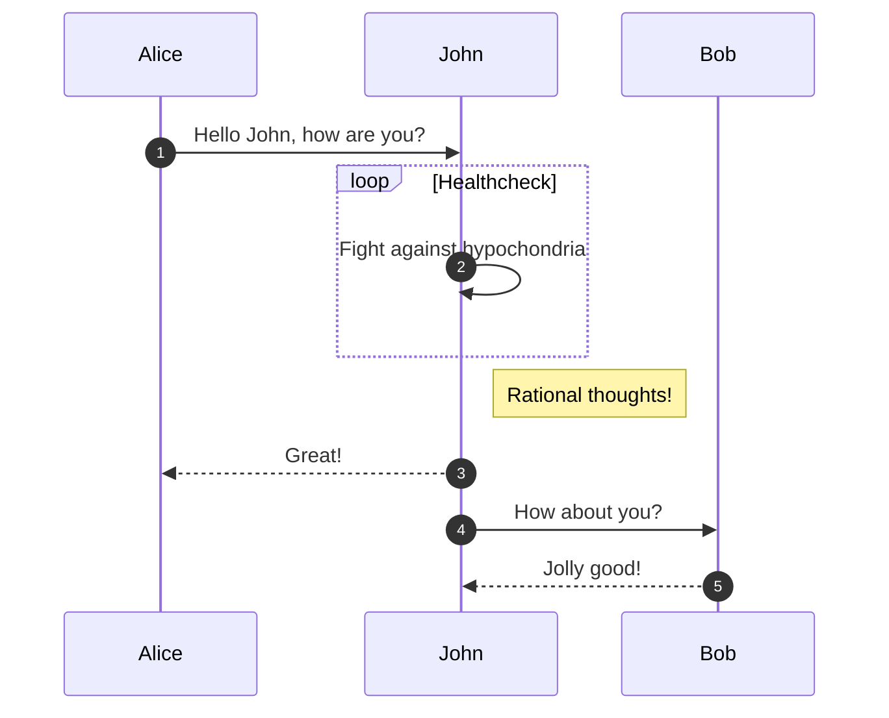

# Elements

As it can be seen subpages can be assigned to pages. Making the structure of GitBook documents flexible.

### Unordered list

* this is a simple
* unordered
* list


### Ordered list

1. this is a simple
2. ordered
3. list


### Task list

* [x] Introduction
* [ ] Content Blocks
* [x] Create a task list


### Code block

```javascript
const exampleFunction = () => {
    console.log("This is an example of how a content block looks like.");
};

exampleFunction();
```


### Others

> Quote Blockasd

### Divider

***

### Info/Quote blocks

<!-- theme: danger -->

> #### Danger Will Robinson!
>
> Here is a danger callout!

<!-- theme: warning -->
> #### Watch Out!
>
> Here is a warning callout!

<!-- theme: success -->

> #### Mission Accomplished
>
> Here is a success callout.

<!-- theme: info -->

> #### A thing to know
>
> Here is an info callout

<!-- theme: none -->

> #### Plain callout
>
> Here is a callout that has no icon.


### Code blocks
```javascript
console.log('this is a code group');
```
```python
print("this is a code group")
```

***
### Graphs and diagrams using Mermaid



### Tabs

<!--
type: tab
title: My First Tab
-->

The contents of tab 1.

<!--
type: tab
title: My Second Tab
-->

The contents of tab 2.

<!-- type: tab-end -->

### Embeded link

https://giphy.com/gifs/barkpost-barkpost-happy-wednesday-working-like-a-dog-eYilisUwipOEM